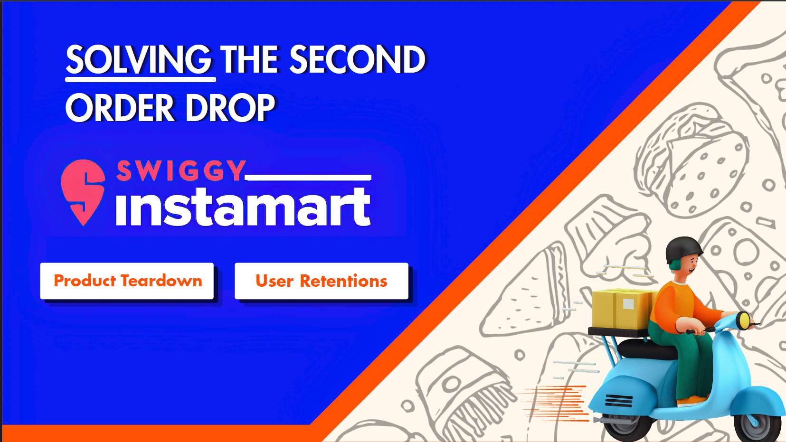

# Solving the Second Order Drop — Swiggy Instamart 🛵

**Project Streaks**: Transforming Swiggy's food ecosystem into a long-term grocery retention engine.

> "Winning the second order isn't about another discount. It's about becoming the customer's grocery habit."

A product teardown and retention strategy case study on Swiggy Instamart, focused on solving why first-time quick-commerce users fail to convert into repeat customers.

---

## 📌 Overview

Instamart converts users well on their **first order** (4.3/5 satisfaction) but loses them immediately after — only **7%** of users become repeating customers, with just **15%** placing a second order at all. This project diagnoses *why* that drop happens and proposes a prioritized set of product solutions to fix it.

## 🎯 Objective

Increase second-order conversion within 30 days by identifying:
- Friction points in the user journey
- Behavioural triggers (or lack thereof)
- Actionable product interventions

## 🔍 Approach

1. **Company & Market Overview** — Swiggy's business model, revenue streams, and Instamart's position in the quick-commerce landscape (vs. Blinkit, Zepto, and local kirana stores).
2. **Retention Funnel Analysis** — Mapping the drop-off from browsing → cart → first order → second order → repeat customer.
3. **User Research**
   - Primary: 60 survey responses + 8 in-depth interviews
   - Secondary: App store reviews, Reddit discussions, industry reports, Swiggy's annual/quarterly filings
4. **User Journey Mapping** — Screen-by-screen walkthrough from app open to order rating, flagging friction points.
5. **User Personas** — Two behavioural archetypes: *The Swiggy Loyalist* (high potential, low awareness) and *The Habit Shopper* (kirana-loyal, hard to convert).
6. **Prioritization** — Scoring four candidate pain points (delivery issues, cart friction, refund complexity, weak top-of-mind awareness) on goal alignment, severity, and user impact.
7. **Solutioning** — Three proposed interventions evaluated using the RICE framework.
8. **Success Metrics Tree** — North Star metric and supporting L1/L2 metrics to measure impact.

## 💡 Key Insight

Instamart wins the first order, but fails to build a repeat grocery habit. Users are satisfied with the product experience — the real barriers are **offline habits, weak re-engagement triggers, and limited ongoing value**, not product quality.

## 🚀 Proposed Solutions

| Solution | Where It Lives | Idea | RICE Verdict |
|---|---|---|---|
| **01 — The Baseline Fix** | Post-checkout (food order) | Cross-sell Instamart items via one-tap add-to-cart at the point of highest purchase intent | Medium impact, medium effort |
| **02 — The Habit Builder (Streaks)** ⭐ | Post-order (retention) | Streak-based reward system with unified "Swiggy Cash," reminder nudges, and milestone unlocks to drive weekly repeat behaviour | **Selected** — High feasibility, high impact, low risk |
| **03 — The Moonshot** | Homepage | Fully AI-personalized homepage that adapts to food, grocery, dineout, and gifting behaviour in real time | High impact, high effort/risk |

**Chosen direction: Project Streaks** — a low-risk, high-feasibility habit loop that rewards consecutive weekly purchases with cashback, backed by reminder notifications, streak history, badges, and a friends leaderboard.

## 📊 Success Metrics Tree

**North Star Metric:** 30-Day Repeat Purchase Rate

- **L1:** Second Order Conversion Rate · Streak Retention Rate · Median Days to Second Order
- **L2:** Reminder Notification CTR · Reward Claim Rate · Hotspot Progress Rate

## 🗂️ Contents

- Company & Instamart overview
- Retention funnel & competitive landscape
- Primary + secondary user research
- User journey maps
- User personas (A & B)
- Pain point prioritization matrix
- Solution deep-dives (Baseline Fix, Streaks, Moonshot)
- Streaks UI/UX mockups
- RICE tradeoff evaluation
- Success metrics tree

## 🛠️ Methodology & Frameworks Used

- Retention funnel analysis
- User persona development
- RICE prioritization
- Success metrics / North Star tree
- Competitive benchmarking (Blinkit, Zepto, local kirana)

## 📚 Sources

Swiggy Annual Report FY25 · Swiggy Business Presentation Q4FY'25 · Swiggy Press Releases · Zepto Annual Report FY'25 · Blinkit Annual Report · Industry Reports (Redseer, Mint) · User Reviews · Reddit Discussions

## 👤 Author

**Shreyansh Gupta**
[LinkedIn](https://www.linkedin.com/)

---

*This is an independent product case study created for a business case competition and is not affiliated with or endorsed by Swiggy.*
